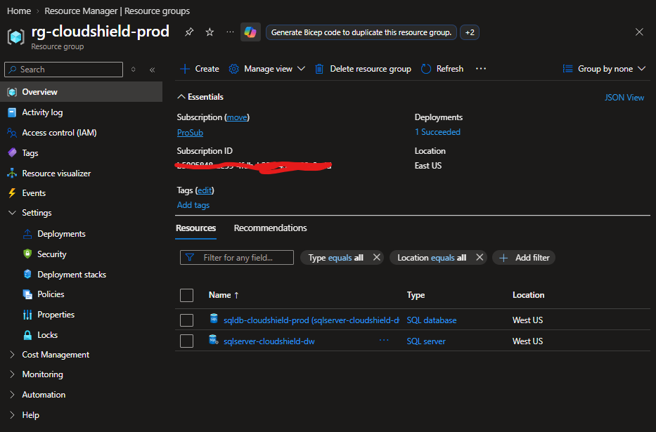
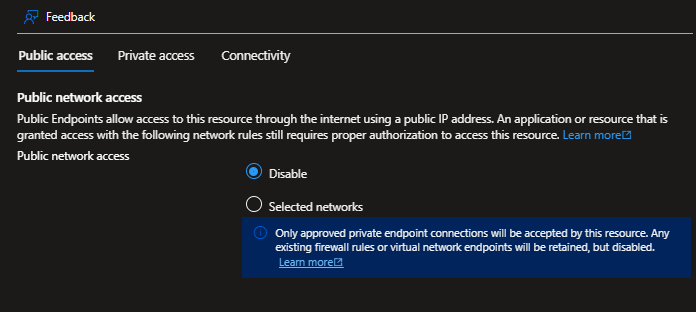
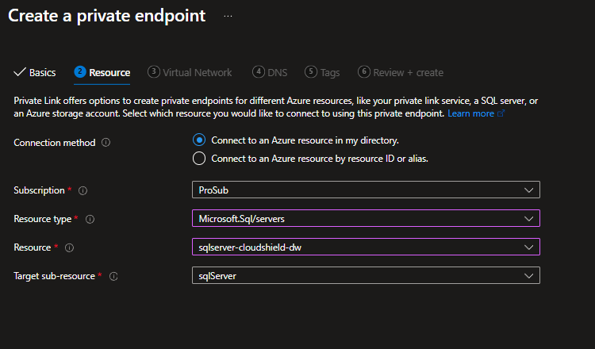
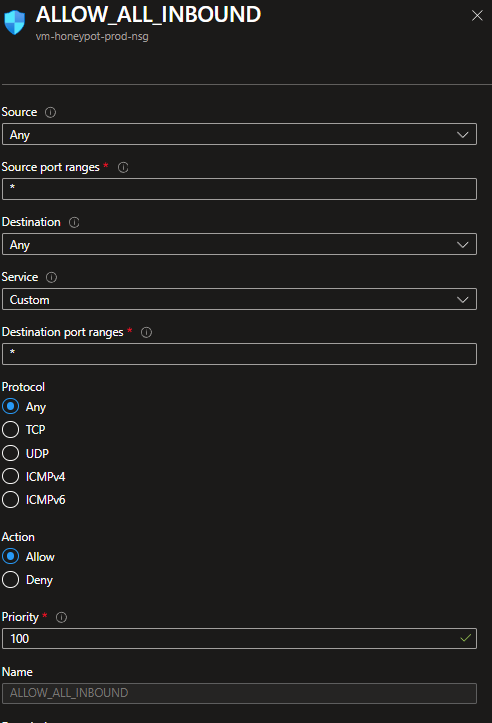
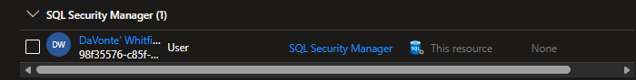

# Module 01: Zero-Trust Azure SQL Architecture, Network Isolation & Dynamic Data Masking

## 📌 Executive Summary
This module demonstrates an end-to-end **Zero-Trust Data Architecture** in Azure SQL Database. By disabling public internet access and routing traffic exclusively through internal **Private Endpoints**, the database is completely isolated at the network level. At the data layer, **Dynamic Data Masking (DDM)** and **Role-Based Access Control (RBAC)** enforce the **Principle of Least Privilege (PoLP)**, protecting sensitive Personally Identifiable Information (PII) at rest without altering the underlying raw data.

---

## 🏗️ Core Architecture & Security Controls

* **Network Isolation:** Public network access is disabled (`Disabled`), forcing all connections through an internal Virtual Network (VNet) via Azure Private Link.
* **Control-Plane Security:** Entra ID authentication and Azure RBAC manage administrative and security permissions without hardcoded SQL credentials.
* **Data-Plane Protection:** Dynamic Data Masking (DDM) obfuscates sensitive attributes (e.g., email addresses) dynamically for low-privileged users while preserving full visibility for authorized security managers.

---

## 📂 File & Asset Breakdown

| File / Asset Name | Purpose |
| :--- | :--- |
| `queries/01_create_customers.sql` | Builds the `Customers` schema, inserts seed data, and configures DDM functions. |
| `queries/02_test_low_privileged_user.sql` | Executes context-switching (`EXECUTE AS USER`) to verify masked outputs for low-privileged users vs. admins. |
| `images/rg-cloudshield.png` | Overview screenshot of the deployed Azure resources inside the target Resource Group. |
| `images/public_access_disabled.png` | Visual verification showing public network access disabled on SQL Server. |
| `images/private_endpoint_resource.png` | Screenshot of Private Endpoint target resource configuration. |
| `images/Inbound_rules.png` | Screenshot of configured Network Security Group (NSG) inbound security rules. |
| `images/Role_assigned_SQLSec.png` | Access Control (IAM) role assignment proof for `SQL Security Manager`. |
| `images/db_login_blocked.png` | Verification screenshot showing connection attempt blocked over public network. |
| `images/Masked.png` | Verification screenshot confirming dynamic data masking during query execution. |

---

## 🛠️ Step-by-Step Implementation Guide

### Step 1: Resource Group Provisioning
1. In the Azure Portal, create a new **Resource Group** named `rg-cloudshield-prod`.
2. Select your target **Region** (e.g., `West US`).

> 💡 **Golden Rule:** Ensure all subsequent resources created in this module are deployed in this exact same region to maintain local network latency and policy consistency.



---

### Step 2: Virtual Network & Subnet Segmentation
1. Create a **Virtual Network (VNet)** named `vnet-cloudshield-prod`.
2. Configure two isolated subnets inside the VNet:
   * **`snet-app`** (`10.0.1.0/24`): Designated for application workloads or virtual machines.
   * **`snet-db`** (`10.0.2.0/24`): Dedicated exclusively to database Private Endpoints.

---

### Step 3: Azure SQL Server Deployment & Public Lockdown
1. Provision an **Azure SQL Server** (e.g., `sqlserver-cloudshield-dw`) and an **Azure SQL Database**.
2. Set **Authentication** to **Microsoft Entra ID authentication only** (or *SQL + Entra ID*).
3. Once deployed, open your SQL Server and navigate to the **Networking** blade:
   * Set **Public network access** to **`Disabled`**.
   * Uncheck **"Allow Azure services and resources to access this server"** to prevent internal backdoor access.



---

### Step 4: Private Endpoint & Private DNS Integration
1. Search for **Private Endpoints** in the Azure Portal and click **+ Create**.
2. **Resource Tab:**
   * **Subscription:** Select your target subscription.
   * **Resource Type:** `Microsoft.Sql/servers`
   * **Resource:** Select your SQL Server (`sqlserver-cloudshield-dw`).
   * **Target sub-resource:** `sqlServer`
3. **Virtual Network Tab:**
   * Select `vnet-cloudshield-prod` and bind it to the target subnet `snet-db`.
4. **DNS Tab:**
   * Enable **Private DNS Zone Integration** (`privatelink.database.windows.net`).
   * This ensures internal requests automatically resolve the database hostname to its private internal IP address (e.g., `10.0.2.x`).



---

### Step 5: Network Security Group (NSG) Hardening
1. Create a **Network Security Group (NSG)** (e.g., `vm-honeypot-prod-nsg`) and associate it with your subnets.
2. Define inbound traffic boundaries:
   * **Production Standard:** Create an inbound rule allowing port **`1433`** (SQL TDS traffic) strictly from `snet-app` (`10.0.1.0/24`) to `snet-db` (`10.0.2.0/24`), followed by a high-priority **Deny All Inbound** rule.

> ⚠️ **Project Testing Note:** For testing and research purposes in this lab environment, an `ALLOW_ALL_INBOUND` rule was applied to capture attack telemetry. In a corporate production environment, you must restrict port `1433` exclusively to approved internal subnets.



---

### Step 6: Control-Plane Access Management (Azure RBAC)
1. Go to your SQL Server’s **Access Control (IAM)** blade.
2. Click **+ Add role assignment**.
3. Select the **`SQL Security Manager`** role (or `Reader` depending on administrative responsibilities).
4. Assign the role to your designated security user or managed identity.



---

### Step 7: Data-Plane Security & Dynamic Data Masking (DDM)
1. Connect to your database via Query Editor or SQL Server Management Studio (SSMS).
2. Execute **`queries/01_create_customers.sql`** to create the customer table and apply built-in masking functions:

```sql
-- Apply Email Masking Function
ALTER TABLE Customers 
ALTER COLUMN Email ADD MASKED WITH (FUNCTION = 'email()');
