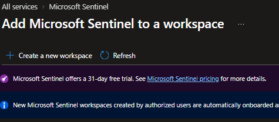
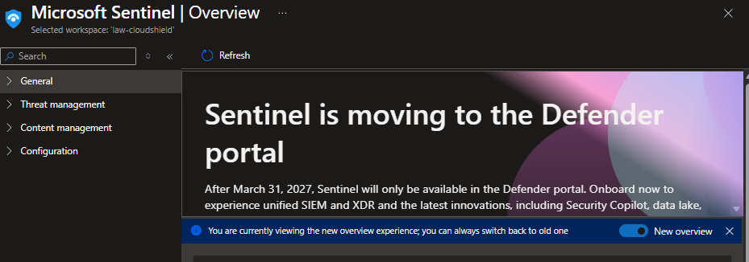
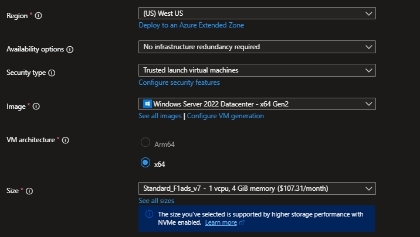
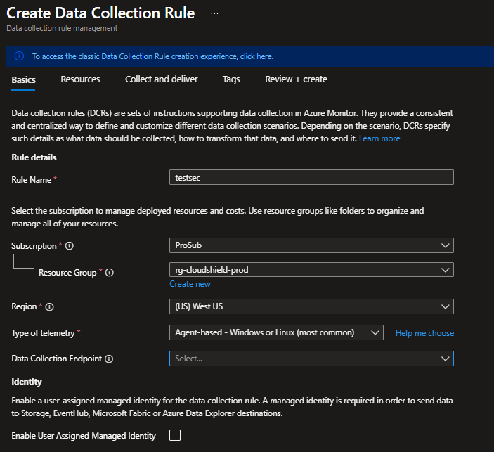
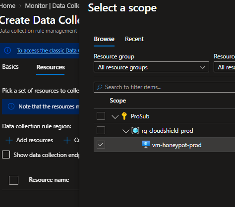
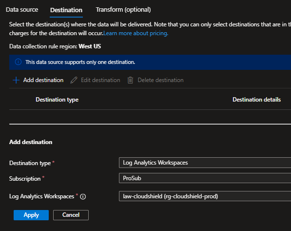
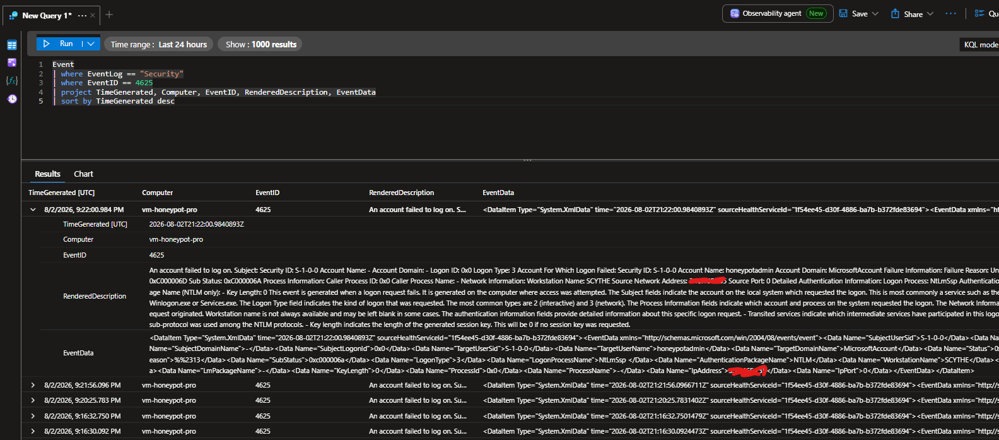
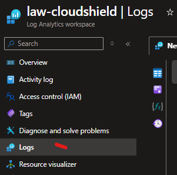

# Module 02: Azure Sentinel SIEM & Windows Honeypot Threat Telemetry

## 📌 Executive Summary
This module demonstrates the deployment of an exposed **Windows Server Virtual Machine** configured as a threat magnet (honeypot) to capture live Remote Desktop Protocol (RDP) brute-force attacks. Telemetry is collected using **Azure Monitor Data Collection Rules (DCR)**, ingested into a centralized **Log Analytics Workspace**, and analyzed with **Microsoft Sentinel** using **Kusto Query Language (KQL)** to hunt for failed logon attempts (`Event ID 4625`).

---

## 🏗️ Core Architecture & Security Controls

* **Threat Magnet (Honeypot):** Windows Server 2022 instance exposed directly to the public internet via Port 3389 (`0.0.0.0/0`).
* **Isolated Network Scope:** The honeypot resides in its own isolated subnet with no internal connectivity to production assets.
* **Centralized Logging:** Security logs stream directly into Azure Log Analytics Workspace via Azure Monitor Data Collection Rules (DCR).
* **SIEM Threat Hunting:** Microsoft Sentinel integrated over Log Analytics to query and analyze live attack telemetry.

---

## 📂 File & Asset Breakdown

| File / Asset Name | Purpose |
| :--- | :--- |
| `images/create_sentinel.png` | Screenshot showing Microsoft Sentinel onboarding to the Log Analytics Workspace. |
| `images/defender.png` | Screenshot of the Microsoft Sentinel Overview blade and Defender portal notification. |
| `images/vm_configuration.png` | Screenshot of the honeypot Virtual Machine deployment configuration. |
| `images/data_collection_config.png` | Screenshot of the Data Collection Rule (DCR) Basics setup blade. |
| `images/add_vm_to_datacollection.png` | Screenshot of scoping the honeypot VM as a target resource in the DCR. |
| `images/adding_datasource .png` | Screenshot of adding Windows Event Logs (Audit Success / Failure) as the data source. |
| `images/adding_destination.png` | Screenshot of setting the Log Analytics Workspace as the destination. |
| `images/failed-rdp-logs.png` | Screenshot of initiating RDP authentication and tracking local failed logon events. |
| `images/checking_logs.png` | Screenshot showing navigation to the Logs blade in Log Analytics Workspace. |
| `images/event_4625_query.png` | Verification screenshot confirming successful KQL log collection for Event ID 4625. |
| `images/Navigate_workbooks.png` | Screenshot showing navigation to Workbooks under Threat Management in Microsoft Sentinel. |

---

## 🛠️ Step-by-Step Implementation Guide

### Step 1: Log Analytics Workspace Provisioning
1. In the Azure Portal, search for **Log Analytics Workspaces** and click **+ Create**.
2. Assign it to your Resource Group (`rg-cloudshield-prod`) and name it `law-cloudshield`.
3. Select your deployment Region (e.g., `West US`).

> 💡 **Purpose:** This workspace serves as the central logging repository for threat data, setting retention policies and storing security events.

---

### Step 2: Microsoft Sentinel Enablement
1. In the Azure Portal search bar, search for **Microsoft Sentinel**.
2. Click **+ Create** / **Add Microsoft Sentinel to a workspace**.
3. Select your workspace (`law-cloudshield`) to onboard Sentinel.

> 📝 **Note:** If Sentinel is already created and assigned to your workspace, select `law-cloudshield` from the list. You may see a notification regarding the Defender portal integration—this can be ignored for this lab.




---

### Step 3: Windows Honeypot Virtual Machine Deployment
1. Search for **Virtual Machines** in the Azure Portal and click **+ Create > Azure virtual machine**.
2. Configure the basic settings:
   * **Resource Group:** `rg-cloudshield-prod`
   * **Virtual Machine Name:** `vm-honeypot-prod`
   * **Region:** `West US`
   * **Availability Options:** `No infrastructure redundancy required`
   * **Security Type:** `Trusted launch virtual machines`
   * **Image:** `Windows Server 2022 Datacenter - x64 Gen2`
   * **Size:** Select the most cost-effective tier available in your region (e.g., `Standard_F1ads_v7`).
3. **Network Security Group (NSG) Inbound Rule:**
   * Configure an inbound security rule allowing **RDP traffic on Port 3389** from **Any** (`0.0.0.0/0`).

> ⚠️ **Isolation Warning:** Ensure this VM is placed in an isolated subnet with no connectivity to internal production resources so it functions strictly as an isolated attack magnet.



---

### Step 4: Data Collection Rule (DCR) Setup
1. Search for **Data Collection Rules** in Azure Monitor and click **+ Create**.
2. **Basics Tab:**
   * **Rule Name:** `testsec`
   * **Resource Group:** `rg-cloudshield-prod`
   * **Type of Telemetry:** `Agent-based - Windows or Linux`
   * *(Optional)* Bind the Private Endpoint created in Module 01 if endpoint isolation is enabled.



3. **Resources Tab:**
   * Click **+ Add resources** and select `vm-honeypot-prod`.



4. **Collect and Deliver Tab:**
   * Click **+ Add data source**.
   * Change **Data source type** to **Windows Event Logs**.
   * Under **Security**, check **Audit success** and **Audit failure**.


   * Navigate to the **Destination** tab, set **Destination type** to **Log Analytics Workspaces**, and select `law-cloudshield`.



---

### Step 5: Live RDP Telemetry Generation
1. Navigate to `vm-honeypot-prod` and locate its primary **Public IP address**.
   * *(Note: If no Public IP is attached to the primary NIC, create and assign one in the network settings.)*
2. Open **Remote Desktop Connection** on your computer.
3. Enter the public IP address of the honeypot VM.
4. Intentionally attempt multiple logins using invalid usernames or passwords to generate local failed authentication logs (`Event ID 4625`).

> 💡 **Local Audit Verification:** You can log into the VM and verify in Windows **Event Viewer** (`Windows Logs > Security`) that **Event ID 4625** (*An account failed to log on*) is actively recording.



---

### Step 6: KQL Threat Hunting & Log Analysis
1. Open your **Log Analytics Workspace** (`law-cloudshield`).
2. In the left navigation menu, click **Logs**.



3. Run the following **Kusto Query Language (KQL)** script against the `Event` table to filter for failed security logon attempts:

```kql
// Query Failed Logons (Event ID 4625) and display key attributes
Event
| where EventLog == "Security"
| where EventID == 4625
| project TimeGenerated, Computer, EventID, RenderedDescription, EventData
| sort by TimeGenerated desc
