# Module 03: Automated SOAR Workflow with Azure Key Vault

## Overview

This module implements a zero-trust, automated Security Orchestration, Automation, and Response (SOAR) workflow using **Azure Logic Apps** and **Azure Key Vault**. 

By eliminating hardcoded credentials, API keys, and static webhook URLs from code and automation workflows, this deployment enforces a secretless architecture where non-human identities dynamically fetch secrets at runtime using fine-grained Role-Based Access Control (RBAC).

---

## Architecture Steps

### Step 1: Create an Azure Key Vault

1. In the Azure Portal, search for and select **Key vaults**.
2. Click **Create**.
3. On the **Basics** tab, configure the following:
   * **Subscription:** Select your active subscription.
   * **Resource Group:** Select your project resource group (e.g., `rg-cloudshield-prod`).
   * **Key Vault Name:** Enter a unique name (e.g., `kv-cloudshield-prod1`).
   * **Region:** Select the same region as your other project resources (e.g., `East US`).
   * **Pricing Tier:** Select **Standard**.

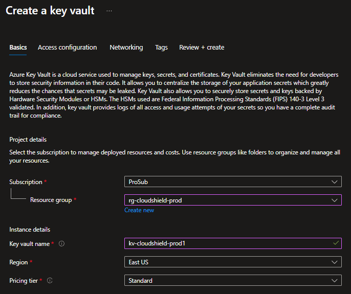

4. Navigate to the **Access configuration** tab.
5. Select **Azure role-based access control (RBAC)** instead of Vault access policy.
6. Click **Review + create**, then click **Create**.

---

### Step 2: Grant Administrator Permissions (RBAC)

1. Open your newly created Key Vault.
2. Click **Access control (IAM)** from the left sidebar.
3. Click **+ Add** and select **Add role assignment**.

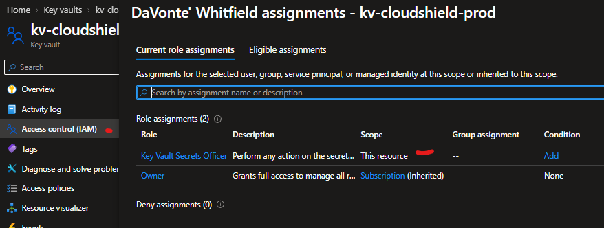

4. Search for and select the **Key Vault Secrets Officer** role, then click **Next**.
5. Under the **Members** tab, select **User, group, or service principal**.
6. Click **+ Select members**, search for your Azure administrator user account, and click **Select**.

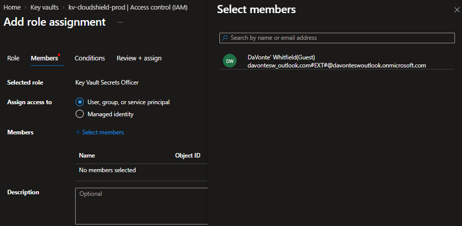

7. Click **Review + assign** to complete the role assignment.

---

### Step 3: Store a Secret in Key Vault

1. Inside your Key Vault, select **Objects** > **Secrets** from the left menu.
2. Click **+ Generate/Import**.

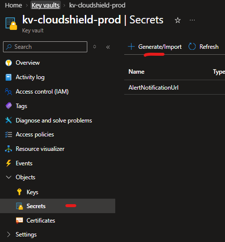

3. Configure the secret properties:
   * **Upload options:** Manual
   * **Name:** `googletest` (or your preferred secret key name)
   * **Secret value:** Enter your target URL or Webhook (e.g., `google.com`)

> **Note:** Storing sensitivity parameters here ensures URLs, API keys, and webhooks are never exposed in plain text within scripts or workflow configuration files.

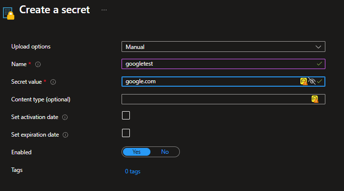

4. Click **Create**.
5. You can click into the secret to view its active version details.

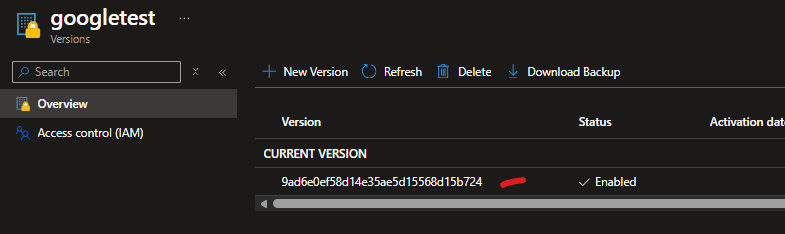

---

### Step 4: Create the Logic App

1. Search for **Logic Apps** in the Azure Portal and click **Add**.
2. When prompted to select a hosting plan, choose **Multi-tenant** under the **Consumption** tier.

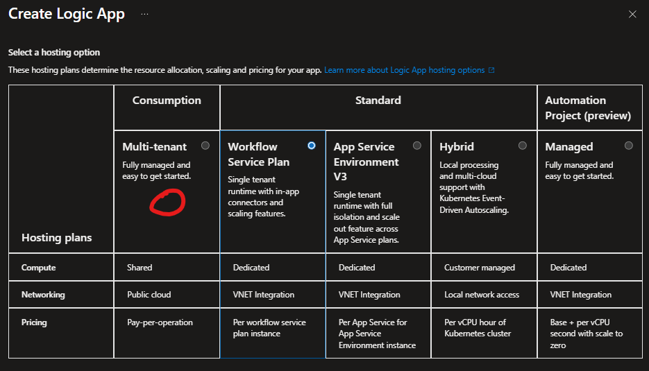

3. Configure the Logic App parameters:
   * **Subscription:** Select your subscription.
   * **Resource Group:** Select your project resource group (`rg-cloudshield-prod`).
   * **Logic App Name:** Enter your workflow name (e.g., `playbook-rdp-alert`).
   * **Region:** Select your deployment region.
   * **Enable Log Analytics:** Select **Yes**.
   * **Log Analytics Workspace:** Select your workspace (e.g., `law-cloudshield`).
   * **Workflow Type:** Select **Stateful**.

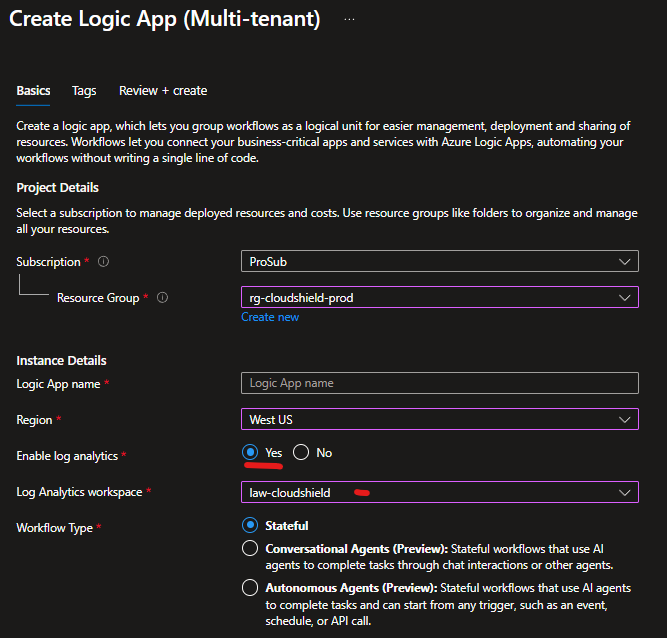

4. Click **Review + create**, then click **Create**.

---

### Step 5: Assign Logic App Access to Key Vault

Following the principle of least privilege, we give the Logic App only the permission to read secrets (**Key Vault Secrets User**), preventing it from making any administrative changes to the vault.

1. Go back to your Key Vault (`kv-cloudshield-prod1`).
2. Click **Access control (IAM)** > **+ Add** > **Add role assignment**.
3. Search for and select the **Key Vault Secrets User** role, then click **Next**.
4. Under **Assign access to**, select **Managed identity**.
5. Click **+ Select members**, select **Logic app** from the Managed Identity dropdown, and choose your Logic App (`playbook-rdp-alert`).

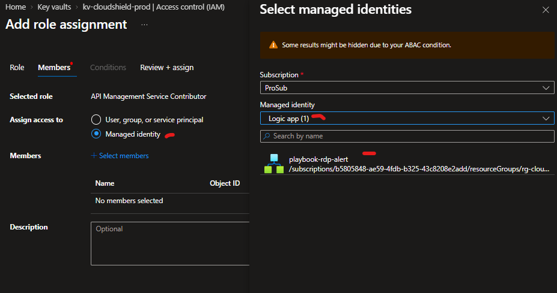

6. Click **Review + assign**.

---

### Step 6: Build the Automated SOAR Workflow

1. Open your Logic App (`playbook-rdp-alert`).
2. Under **Development Tools** in the left menu, click **Logic app designer**.

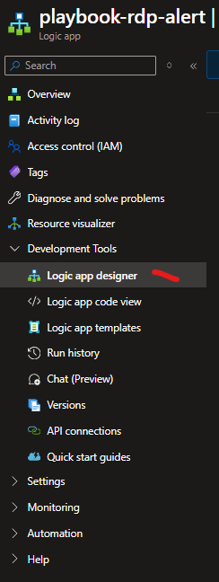

3. Click **Add a trigger**.
4. Search for and select **When an HTTP request is received**.

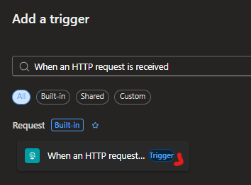

5. Click the **+** icon under the trigger step and select **Add an action**.

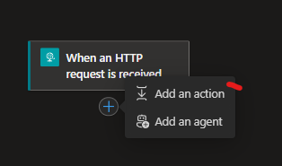

6. Search for **Azure Key Vault** and select the **Get secret** action.

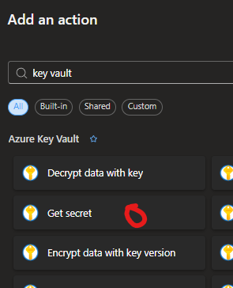

7. In the **Name of the secret** field, enter the exact name of the secret created in Step 3 (`AlertNotificationUrl`). Ensure connection is established using the **System-assigned managed identity**.

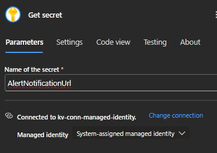

8. Click the **+** icon below the *Get secret* step and select **Add an action**.
9. Search for and select **Compose** (under Data Operations).

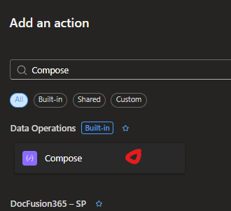

10. Click the dynamic content (lightning bolt) icon and select the **value** output from the *Get secret* step.

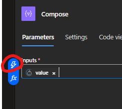

11. Click **Save** in the top menu to save your workflow.

---

## Verification & Testing

1. Run the workflow directly within the Logic App Designer by clicking **Run**.
2. Verify that all steps pass with green checkmarks.

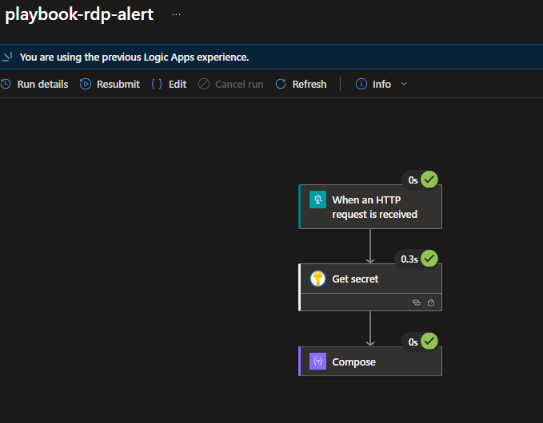

3. Check the **Logic app run details** panel to inspect runtime durations and action statuses.

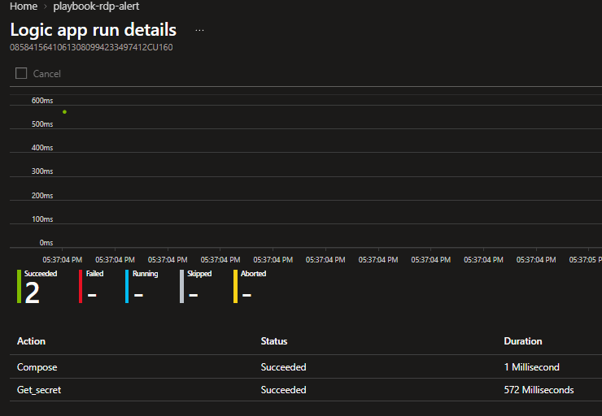

### Key Takeaway
Testing confirms that the Azure Logic App successfully authenticates to Azure Key Vault using its Managed Identity, retrieves the encrypted secret at runtime, and completes execution without storing plain-text passwords or credentials in any configuration file.
